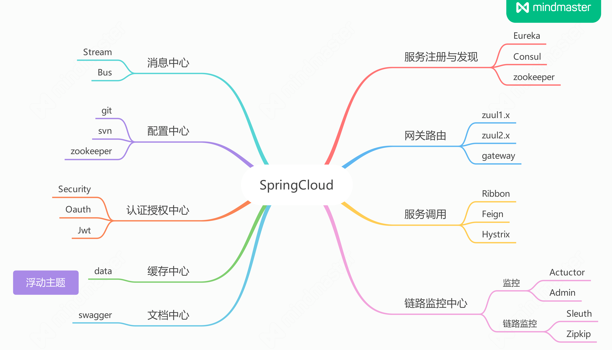

# firstSpringCloud基础配置
 
 **先启动eureka发现注册服务**，再启动后续服务
 
 ## 启动
 可以通过idea中的启动mian函数来启动各个服务，也可以使用打包方式把整个服务打包成jar包的方式来启动：
 
 ```shell script
    mvn clean package -Dmaven.test.skip=true -U 
```
依次启动各个服务：
 ```shell script
    java -jar ux-eureka-1.0-SNAPSHOT.jar
```

同时也可以通过这个命令来检验我们的程序是否存在语法错误等。


# SpringCloud


## Eureka

包含两个组件Eureka Server和Eureka Client
通常把EurekaServer称为Eureka，而EurekaClient一般就称为微服务

### EurekaServer集群
每一个EurekaServer保持的源信息（EurekaClient注册到Server所提供的信息）都是一致的，需要相互协调同步复制，也就说EurekaServer会持有整个系统中的微服务信息
### EurekaClient（Provider、Consumer）
分为提供者与消费者
提供者与消费者直接通过EurekaServer建立的连接进行服务的提供与使用
EurekaClient在启动后会向EurekaServer发起连接，并把源信息传递给Server
* 服务注册，启动后向Server发起连接
* 心跳续约，向Server同步Client状态
* 下线，通知Server清理当前Client源信息
#### ConcurrentHashMap<String,Map<String,Lease<InstanceInfo>>> 源信息载体
key为实例的名称，Value可以是实例的端口号，状态等

> 其实就是WebSocket搭建起来的服务？


## Zuul

API Gateway服务器，本质上是一个WebServlet应用（路由转发？
提供了动态路由、监控等服务，这些功能实现的核心是一系列的filters

request ——> prefileter（customfilter）——> routerfilter ——> postfilter ——> response


在这过程中如果发生错误会调用errorfilter传送给prostfilter以反馈response，
解析过程中通过routerfilter与对应的微服务通讯

## Ribbon
负载均衡算法 + 应用名称(app_name)转具体的ip:prot
负载均衡目的是每个微服务都会部署很多的实例，在调用中怎样去选择实例，在ribbon中叫做rule(规则)
rule：Ribbon提供了很多实现
* 轮询（**默认**）
* 选择最小请求数实例
* 随机


## Feign
定义接口，在接口上添加注解，消费者通过调用接口的形式进行服务消费
Feign是基于Ribbon的，所以其也拥有负载均衡等特性
同时Feign整合了Hystrix，实现了熔断降级的功能

作用也是用于实现微服务，服务之间的调用，通过Ribbon实现ip端口间的调用，已经相关的负载均衡处理流，Feign应该是Ribbon的超集，它**本质上是对Ribbon的上级封装**，使ribbon的使用方式更加的简单，同时也整合了Hystrix

## Hystrix
服务器雪崩是熔断器解决的最核心问题
> 服务器雪崩，在微服务中其实就是多个服务层级间的相互调用，基础服务故障就有可能导致级联整个服务器不可用的情况。

三个特性：**断路器机制**、**Fallback**、**资源隔离**
* 断路器机制：  当Hystrix Command请求后端服务失败数量超过一个阈值比例（默认50%），断路器就会切换到开路状态，即所有的请求会直接失败而不会发送到后端扩散传播
* Fallback：   降级回滚策略，当请示失败之后有一个兜底（降级）的返回，也就说请求用户信息，假设请求失败，就会返回一个空的用户信息或者缓存中的数据，而不是返回异常
* 资源隔离：    **不同的微服务调用使用不同的线程池来管理**，主要会根据调用的远程服务划分成多个线程池，也就是每个服务都会有对应单独的线程池，这样做的好处就是运行环境被隔离开，一旦项目代码出现bug或者线程池耗尽也不会对系统的其他服务造成影响，代价是带来一些维护多个线程池的性能开销